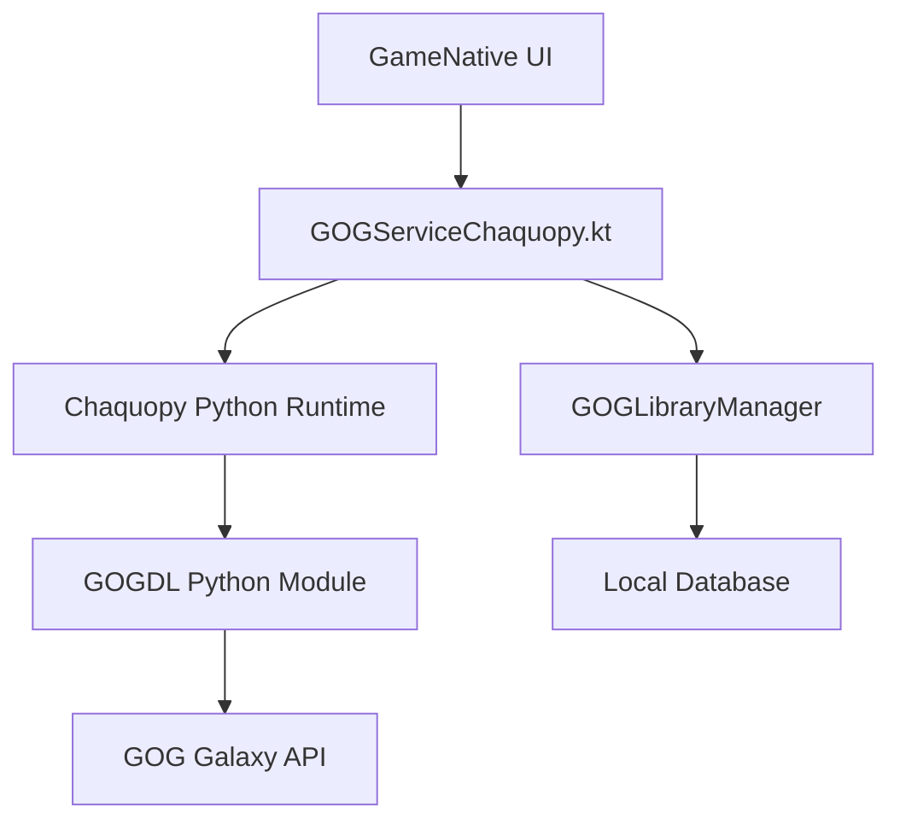

# GOG Integration for GameNative

This document describes the implementation of GOG library support in GameNative using Chaquopy Python integration.

## Overview

GOG integration is implemented using **Chaquopy** for Python-Android interoperability with the following architecture:

```
GameNative Android App
├── GOGServiceChaquopy.kt (Kotlin service layer)
├── Chaquopy Python Runtime
├── GOGDL Python Module
└── GOG Galaxy API
```

## What We've Built

### 1. Kotlin Service Layer (`app/src/main/java/app/gamenative/service/GOG/`)

- **`GOGServiceChaquopy.kt`**: Main service class for GOG operations using Chaquopy
- **`GOGLibraryManager.kt`**: Manages GOG library synchronization with local database
- **Features**:
  - Authentication with GOG
  - Library management
  - Game downloading
  - Game launching
  - Integration with existing GameNative architecture

### 2. Data Models (`app/src/main/java/app/gamenative/data/`)

- **`GOGGame.kt`**: Data classes for GOG games and credentials
- **`Game.kt`**: Unified interface supporting both Steam and GOG games

### 3. Integration Points

- **`PluviaApp.kt`**: Initialize GOGServiceChaquopy on app startup
- **`AccountManagementScreen.kt`**: GOG authentication UI
- **Unified library**: GOG games appear alongside Steam games

## Architecture Diagram



## Implementation Status

### ✅ Completed
- [x] Implemented GOGServiceChaquopy with Chaquopy
- [x] Integrated with GameNative app lifecycle
- [x] Created data models for GOG games
- [x] Set up unified Game interface for Steam/GOG
- [x] Implemented library management and synchronization
- [x] Added authentication UI integration
- [x] Organized services in clean folder structure

### 🔄 Current State
The GOG integration is **functional** and uses:
- **Chaquopy** for Python runtime on Android
- **Direct GOGDL integration** through Python modules
- **Unified game library** showing both Steam and GOG games

## Usage Example

```kotlin
// Initialize GOG service (done automatically in PluviaApp)
GOGServiceChaquopy.initialize(context)

// Authenticate with GOG
val authResult = GOGServiceChaquopy.authenticate("/path/to/auth.json")

// Get GOG library
val libraryResult = GOGServiceChaquopy.getLibrary("/path/to/auth.json")
if (libraryResult.isSuccess) {
    val games = libraryResult.getOrThrow()
    // Display games in UI
}

// Download a game
val downloadResult = GOGServiceChaquopy.downloadGame(
    gameId = "1234567890",
    installPath = "/storage/emulated/0/GameNative/gog_games/game_name",
    authConfigPath = "/path/to/auth.json"
)

// Launch a game (integrates with existing Wine infrastructure)
val launchResult = GOGServiceChaquopy.launchGame(
    installPath = "/path/to/installed/game",
    authConfigPath = "/path/to/auth.json"
)
```

## Integration with Existing GameNative Features

### Library Screen
- ✅ GOG games integrated into unified library view
- ✅ Support filtering by platform (Steam/GOG)
- ✅ Unified `Game` interface for both platforms

### Download Manager
- 🔄 Integration with existing `DownloadService` (in progress)
- 🔄 Show GOG downloads alongside Steam downloads
- 🔄 Support pause/resume for GOG downloads

### Game Launching
- 🔄 Extend `XServerScreen` to handle GOG games
- ✅ Use existing Wine/Box86/Box64 infrastructure
- 🔄 Support GOG-specific launch parameters

## File Structure

```
app/
├── src/main/
│   ├── java/app/gamenative/
│   │   ├── data/
│   │   │   ├── GOGGame.kt          # GOG data models
│   │   │   └── Game.kt             # Unified game interface
│   │   └── service/
│   │       ├── GOG/                # GOG services organization
│   │       │   ├── GOGServiceChaquopy.kt  # Main GOG service
│   │       │   └── GOGLibraryManager.kt   # Library management
│   │       └── [Steam services...]  # Steam services at root level
│   └── python/
│       └── android_compat.py       # Android compatibility for Python
└── docs/
    └── GOG_INTEGRATION.md          # This file
```

## Build Requirements

### Prerequisites
1. **Chaquopy**: Already configured in the project
2. **Python dependencies**: Managed by Chaquopy (requests, gogdl)
3. **GOGDL**: Installed automatically from Heroic Games Launcher GitHub repository (v1.1.2)

### Build Steps
1. **Standard Android build**:
   ```bash
   ./gradlew assembleDebug
   ```

2. **Chaquopy handles Python integration automatically**

## Authentication Flow

1. User initiates GOG login in AccountManagementScreen
2. GOGServiceChaquopy handles authentication with GOGDL
3. Credentials stored securely using Android preferences
4. Library automatically synced on successful authentication

## Performance Considerations

- **Startup Time**: GOG initialization adds minimal overhead with Chaquopy
- **Memory Usage**: Chaquopy runtime is optimized for Android
- **Storage**: GOGDL and dependencies managed by Chaquopy
- **Network**: GOG API calls are lightweight, game downloads are bandwidth-intensive

## Security Considerations

- **Credentials**: Store GOG auth tokens securely using Android SharedPreferences
- **Permissions**: Requires INTERNET and STORAGE permissions
- **Sandboxing**: Chaquopy runs in app sandbox
- **Updates**: GOGDL updated through dependency management

## Troubleshooting

### Common Issues

1. **"ModuleNotFoundError: No module named 'gogdl'"**
   - Clean and rebuild the project to trigger pip installation
   - Verify network connectivity during build for git clone
   - Check Chaquopy pip configuration in build.gradle.kts

2. **"Chaquopy Python error"**
   - Check Chaquopy configuration in build.gradle
   - Verify Python dependencies are correctly specified

3. **"GOG authentication failed"**
   - Verify network connectivity
   - Check GOG service status
   - Clear stored credentials and re-authenticate

4. **"Library sync failed"**
   - Check GOG authentication status
   - Verify network connectivity
   - Check application logs for detailed errors

### Debug Commands

```bash
# Check build logs for Chaquopy issues
./gradlew assembleDebug --info

# Check app logs
adb logcat | grep -E "(GOG|Chaquopy)"
```

## Version Management

The project uses **GOGDL v1.1.2** (released Sep 10, 2024) for stability. This version includes:
- ✅ Fixed Windows game launching
- ✅ Native runner detection in Flatpak
- ✅ Full save sync with automatic file deletion

To update to a newer version:
1. Check [GOGDL releases](https://github.com/Heroic-Games-Launcher/heroic-gogdl/releases)
2. Update the version tag in `app/build.gradle.kts`
3. Test thoroughly before deploying

## Future Enhancements

1. **Enhanced Download Management**: Full integration with DownloadService
2. **Offline Mode**: Cache library data for offline browsing
3. **Cloud Saves**: Implement GOG cloud save synchronization
4. **DLC Support**: Handle downloadable content
5. **Achievement System**: Integrate GOG achievements
6. **Social Features**: GOG friends and multiplayer support

## Contributing

When contributing to GOG integration:

1. **Test thoroughly** on different Android versions
2. **Follow existing code style** in GameNative
3. **Update documentation** for any API changes
4. **Consider performance impact** of new features
5. **Maintain compatibility** with existing Steam functionality
6. **Respect service organization**: Keep GOG services in `/service/GOG/` folder

## License

This integration uses:
- **GOGDL**: GPL-3.0 (https://github.com/Heroic-Games-Launcher/heroic-gogdl)
- **GameNative**: Check project license
- **Chaquopy**: Commercial license (for distribution)

Ensure compliance with all applicable licenses when distributing.